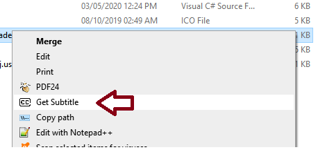
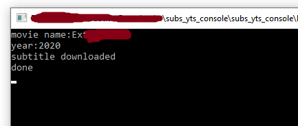

# subs_yts_console
Movie Subtitle Downloader 

Usage:
1. Get a free OMDb API key from https://www.omdbapi.com/apikey.aspx
2. Put the key into 'omdbapikey' variable in Program.cs file
3. Build the Project 
4. Download the 'subs_yts_console/shell hook sub-downloader.reg' 
5. Open the .reg file in text editor and replace it with build .exe file's path 
6. Save the .reg file and run or merge it, which will add a context menu option

Thats it, now if everything is done right,
Just right click on a movie file and click on Get Subtitle from the context menu,
the subtile (if found) will be downloaded into the movie file folder.

 

